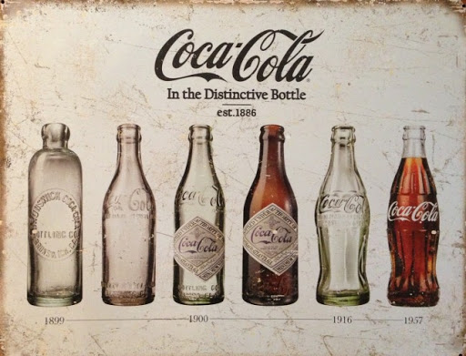
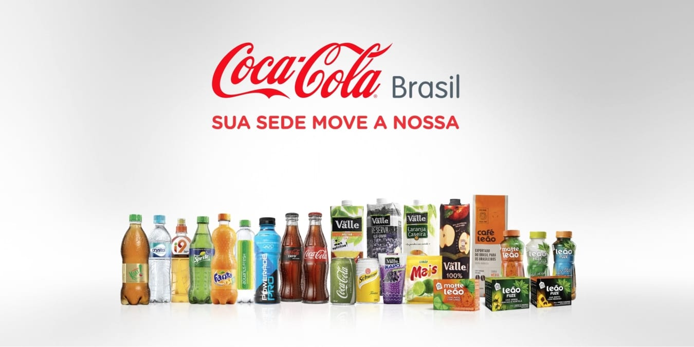

#123
<html lang="pt-br">
    <head>
        <meta charset="utf-8">
        <meta name="viewport" content="width=device-width, initial-scale=1.0">
        <title>a história da Coca Cola</title>
                         
  </head>
     <body>
        

            
            <h1 id="sla">A história da Coca Cola</h1>
       

             
       

           <h2 id="titulo">História</h2>
           
A história da Coca-Cola iniciou-se no ano de 1886, em Atlanta nos Estados Unidos, quando um farmacêutico resolveu criar um xarope para problema de indigestão. Assim no dia 08 de maio, John S. Permberton criou a formula que deu origem a bebida mais famosa do mundo. Desta forma a Coca-Cola iniciou o seu legado, sendo comercializada pela primeira vez na farmácia de Jacobs, onde o xarope era misturado com água gaseificada. Porém ela era vendida por 5 cêntimos o copo, além de que apenas 9 copos eram comercializados por dia. Contudo a bebida chamou atenção dos clientes que aceitavam experimenta-la.

       

            
        

           <h2 id="titulo">Modelos engarrafados</h2>
           
Após passar cerca de 11 anos desde a primeira comercialização do produto na farmácia em Atlanta a Coca-Cola saiu dos EUA. E em 1899 foi fechado o primeiro acordo, com exclusividade para a bebida ser engarrafada. A concessão foi dada aos advogados Benjamin F. Tomas e Joseph B. Whitehead por apenas U$ 1 dólar. Esse é um dos momentos mais importantes da história da Coca-Cola.Contudo nos primeiros primeiros anos do século XX mais de 400 fábricas começaram a engarrafar a Coca-Cola nos Estados Unidos, assim como no Panamá, Canadá e Cuba. O que causou um grande problema. Isso foi porque cada empresa usava um tipo de garrafa, existindo vários modelos assim gerando uma confusão nos consumidores.Por conta disso em 1915 a empresa decidiu realizar um concurso para padronizar o seu modelo de garrafa. O vencedor foi Alexandre Samuelson, que criou a garrafa contour. Bem como, juntamente como o logotipo Coca-Cola se tornou um dos ícones mais reconhecidos da Companhia.

       

       

          
       

            
       

           <h2 id="titulo">Sucesso da franquia</h2>
           
A Coca-Cola chegou ao Brasil no ano de 1942. Bem como atualmente a divisão da bebida no país é uma das quatro maiores operações da The Coca-Cola Company. Assim, o nosso sistema é composto pela Coca-Cola Brasil e mais 16 grupos empresarias independentes.

            Essas Fabricas autorizadas, além do Leão Junior e a Del Valle são responsáveis pela elaboração do produto final. Além de possuir cerca de 46 unidades industriais. Sendo elas espalhadas estrategicamente por todo o país, produzindo bebidas não alcoólicas, sucos, refrigerantes, chás, achocolatados, etc.
            
            Assim gerando por volta de 53 mil trabalhadores diretos, além de mais de 500 mil empregos indiretos. Com o compromisso de produzir, engarrafar e distribuir tais produtos por todo o país, de acordo com o padrão de qualidade Coca-Cola

        

             
        

            <h2 id="titulo">Estratégias</h2>
            
A marca Coca-Cola não cresceu de uma hora para a outra, assim durante a sua história a empresa adotou várias estratégias para o seu progresso. Desta forma, nos anos 70 a propaganda que sempre foi muito importante se torna a alma o negócio, relacionando a marca com a alegria de viver e a liberdade.A exemplo temos a propaganda de 1971, onde jovens, de várias partes do mundo subiam para o pico de uma montanha na Itália. E juntos cantavam “I’d Like to Buy the World a Coke” que na tradução livre significa, “eu gostaria de comprar uma Coca-Cola para o mundo.

        

            
        

           <iframe width="680" height="281" src="https://www.youtube.com/embed/1VM2eLhvsSM" title="YouTube video player" frameborder="0" allow="accelerometer; autoplay; clipboard-write; encrypted-media; gyroscope; picture-in-picture" allowfullscreen></iframe>
           
<strong>Video de propaganda da coca cola</strong>

        

            
        

            <h2 id="titulo">Coca-Cola no Brasil</h2>
            
            
A Coca-Cola chegou ao Brasil no ano de 1942. Bem como atualmente a divisão da bebida no país é uma das quatro maiores operações da The Coca-Cola Company. Assim, o nosso sistema é composto pela Coca-Cola Brasil e mais 16 grupos empresarias independentes.

                Essas Fabricas autorizadas, além do Leão Junior e a Del Valle são responsáveis pela elaboração do produto final. Além de possuir cerca de 46 unidades industriais. Sendo elas espalhadas estrategicamente por todo o país, produzindo bebidas não alcoólicas, sucos, refrigerantes, chás, achocolatados, etc.
                
                Assim gerando por volta de 53 mil trabalhadores diretos, além de mais de 500 mil empregos indiretos. Com o compromisso de produzir, engarrafar e distribuir tais produtos por todo o país, de acordo com o padrão de qualidade Coca-Cola.

        

    </body>
</html>
